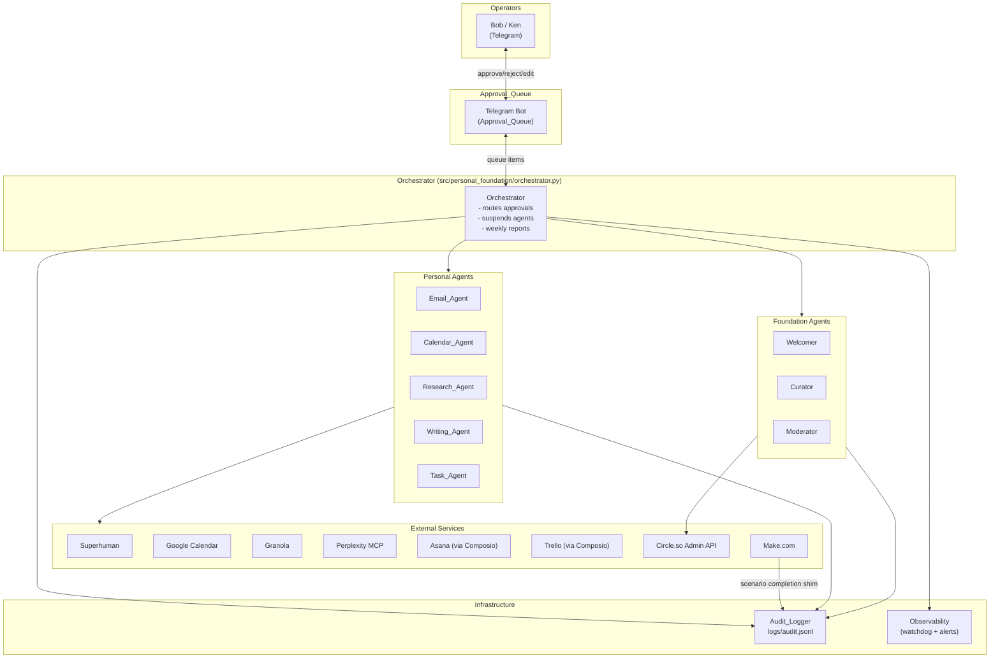

# Design Document: Personal Foundation Agent Automation

## Overview

This system automates the personal and foundation operations of Bob Rapp and Ken Johnston,
co-founders of the AIGovOps Foundation. It is an **internal** system — not a product — that
lets two people run a nonprofit and their professional work at the scale of a full ops team.

The system is implemented as a new Python package at `src/personal_foundation/`, cleanly
separated from the customer-facing `src/setup_agent.py` path. It reuses the existing
`src/audit_log.py`, `src/telegram_meta.py`, and `src/observability.py` patterns rather than
reinventing them.

### Scope

| Domain | Agents |
|--------|--------|
| Personal work | Email_Agent, Calendar_Agent, Research_Agent, Writing_Agent, Task_Agent |
| Foundation community | Welcomer, Curator, Moderator |
| Coordination | Task_Agent (outreach), Orchestrator |
| Governance | Audit_Logger, weekly reports |

### Key Design Principles

1. **Human-in-the-loop by default** — every consequential action passes through the
   Approval_Queue (Telegram) before execution. Agents draft; humans decide.
2. **Provenance everywhere** — every agent action is logged to `logs/audit.jsonl` with
   operator, UTC timestamp, model, prompt summary, result summary, and git SHA.
3. **Dry-run first** — all agents respect `DRY_RUN_MODE`; no external API call is made
   when the flag is set.
4. **Separation from customer product** — `src/personal_foundation/` has no cross-imports
   into `src/setup_agent.py` or any customer-provisioning module.
5. **Extend, don't rewrite** — the system reuses existing patterns (audit_log, telegram_meta,
   observability) and adds new modules only where genuinely new behavior is needed.

---

## Architecture

### High-Level Topology



### Orchestration Layer

Make.com is the **cross-platform trigger and scheduling layer**. It fires webhooks that
invoke Python agent entry points. The Python agents contain all business logic, call
external APIs, and write to the Audit_Logger. Make.com scenarios are thin: trigger →
HTTP POST to agent endpoint → done.

Circle.so native AI Workflows handle **in-platform-only** flows (keyword tagging,
onboarding sequences, profanity filtering) without routing through Make.com.

The Orchestrator Python module manages the Approval_Queue state machine, agent suspension,
and weekly report assembly.

### Deployment Model

```
make install-foundation
  └─ installs Python deps
  └─ creates config/personal-foundation/ (gitignored)
  └─ registers Make.com webhook URLs
  └─ runs make doctor-foundation

make run-foundation   (or systemd unit)
  └─ starts Orchestrator (long-running)
  └─ starts Telegram bot listener
  └─ starts watchdog loop
```

---

## Components and Interfaces

### Package Structure

```
src/personal_foundation/
├── __init__.py
├── orchestrator.py          # Approval_Queue state machine, agent suspension
├── agents/
│   ├── __init__.py
│   ├── email_agent.py       # Email_Agent
│   ├── calendar_agent.py    # Calendar_Agent
│   ├── research_agent.py    # Research_Agent
│   ├── writing_agent.py     # Writing_Agent
│   ├── task_agent.py        # Task_Agent (tasks + outreach)
│   ├── welcomer.py          # Welcomer (Circle.so)
│   ├── curator.py           # Curator (Circle.so)
│   └── moderator.py         # Moderator (Circle.so)
├── integrations/
│   ├── __init__.py
│   ├── circle_client.py     # Circle Admin API wrapper
│   ├── composio_client.py   # Composio (Asana, Trello) wrapper
│   ├── granola_client.py    # Granola export API wrapper
│   ├── perplexity_client.py # Perplexity MCP wrapper
│   └── make_shim.py         # Make.com audit shim (webhook receiver)
├── approval_queue.py        # Queue data model + Telegram presentation
├── audit_shim.py            # Thin wrapper over src/audit_log.py with personal/ prefix
└── config.py                # Pydantic config loader for config/personal-foundation/
```

### Agent Base Interface

Every agent inherits from `BaseAgent`:

```python
class BaseAgent:
    agent_prefix: str  # "personal/" or "foundation/"
    agent_name: str    # e.g. "email_agent"

    def __init__(self, config: FoundationConfig, dry_run: bool = False): ...

    def log(self, action: str, command: str, **kwargs) -> AuditEntry:
        """Delegates to audit_log.log_action with prefixed agent name."""

    def queue(self, item: ApprovalItem) -> None:
        """Places an item in the Approval_Queue via Orchestrator."""
```

### Approval_Queue Interface

```python
@dataclass
class ApprovalItem:
    item_id: str           # UUID
    agent: str             # prefixed agent name
    action_type: str       # "email_draft" | "calendar_confirm" | "post" | ...
    description: str       # plain-language description (shown to Bob/Ken)
    draft_content: str     # the actual draft or decision
    rationale: str         # one-line editorial rationale (Writing_Agent)
    created_at: datetime
    expires_at: datetime   # created_at + 24h; triggers reminder
    status: str            # "pending" | "approved" | "rejected" | "edited"
    reviewer: str | None
    reviewed_at: datetime | None
    rejection_reason: str | None

class ApprovalQueue:
    def enqueue(self, item: ApprovalItem) -> None: ...
    def approve(self, item_id: str, reviewer: str) -> ApprovalItem: ...
    def reject(self, item_id: str, reviewer: str, reason: str) -> ApprovalItem: ...
    def edit(self, item_id: str, new_content: str) -> ApprovalItem: ...
    def pending(self) -> list[ApprovalItem]: ...
    def overdue(self, threshold_hours: int = 24) -> list[ApprovalItem]: ...
```

### Orchestrator Interface

```python
class Orchestrator:
    def __init__(self, config: FoundationConfig, dry_run: bool = False): ...

    # Approval flow
    def present_to_telegram(self, item: ApprovalItem) -> None: ...
    def handle_approval(self, item_id: str, reviewer: str) -> None: ...
    def handle_rejection(self, item_id: str, reviewer: str, reason: str) -> None: ...
    def handle_edit(self, item_id: str, new_content: str) -> None: ...

    # Agent lifecycle
    def suspend_agent(self, agent_name: str, reason: str) -> None: ...
    def resume_agent(self, agent_name: str) -> None: ...
    def is_suspended(self, agent_name: str) -> bool: ...

    # Reporting
    def weekly_governance_report(self) -> str: ...
    def check_failure_rates(self) -> None: ...
```

### Circle Client Interface

```python
class CircleClient:
    """Wraps Circle Admin API. Uses Headless Auth JWT for DM delivery."""

    def get_member(self, member_id: str) -> CircleMember: ...
    def send_dm(self, member_id: str, body: str) -> bool: ...
    def post_to_space(self, space_id: str, body: str) -> CirclePost: ...
    def apply_tag(self, member_id: str, tag: str) -> bool: ...
    def flag_post(self, post_id: str, reason: str) -> bool: ...
    def list_recent_posts(self, days: int, space_id: str | None) -> list[CirclePost]: ...
    def get_post_engagement(self, post_id: str) -> int: ...  # reactions + comments
```

### Make.com Audit Shim

A lightweight HTTP endpoint (FastAPI or Flask) that Make.com calls at scenario completion:

```python
# POST /make-shim/scenario-complete
# Body: { "scenario_name": str, "status": "success"|"failure", "timestamp": str }
def receive_make_completion(payload: MakeCompletionPayload) -> None:
    log_action(
        action="make_scenario_complete",
        command=f"make.com:{payload.scenario_name}",
        agent="foundation/make_shim",
        status=payload.status,
        result_summary=f"Make.com scenario '{payload.scenario_name}' completed: {payload.status}",
    )
```

---

## Data Models

### FoundationConfig (Pydantic)

```python
class TelegramFoundationConfig(BaseModel):
    bot_token: str
    approval_chat_id: str       # Bob + Ken's shared approval channel
    bob_chat_id: str
    ken_chat_id: str

class CircleConfig(BaseModel):
    api_key: str
    community_id: str
    welcome_space_id: str
    digest_space_id: str
    headless_auth_jwt: str      # for DM delivery

class ComposioConfig(BaseModel):
    api_key: str
    asana_workspace_id: str
    trello_board_id: str

class PerplexityConfig(BaseModel):
    api_key: str

class FoundationConfig(BaseModel):
    telegram: TelegramFoundationConfig
    circle: CircleConfig
    composio: ComposioConfig
    perplexity: PerplexityConfig
    dry_run: bool = False
    bob_timezone: str = "America/Los_Angeles"
    max_emails_per_hour: int = 50
    approval_expiry_hours: int = 24
    agent_failure_rate_threshold: float = 0.10
    agent_consecutive_failure_threshold: int = 5
```

### ResearchItem

```python
@dataclass
class ResearchItem:
    item_id: str
    source_url: str
    title: str
    published_at: datetime
    pillar_scores: dict[str, int]   # {"governance_as_code": 4, ...}
    relevance_score: int            # 1–5 (max of pillar_scores)
    summary: str | None             # ≤150 words; None if score < 4
    scan_session_id: str            # groups items from one scan run
```

### OutreachContact

```python
@dataclass
class OutreachContact:
    contact_id: str
    name: str
    pipeline_stage: PipelineStage   # enum: new | first-contact-sent | ...
    asana_task_id: str
    last_contact_date: datetime | None
    notes: str
```

```python
class PipelineStage(str, Enum):
    NEW = "new"
    FIRST_CONTACT_SENT = "first-contact-sent"
    RESPONDED_INTERESTED = "responded-interested"
    RESPONDED_NOT_INTERESTED = "responded-not-interested"
    NEEDS_MORE_INFO = "needs-more-info"
    PARTNER_CONFIRMED = "partner-confirmed"
    ARCHIVED = "archived"
```

### CirclePost

```python
@dataclass
class CirclePost:
    post_id: str
    space_id: str
    author_member_id: str
    title: str
    body: str
    published_at: datetime
    reactions: int
    comments: int
    tags: list[str]

    @property
    def engagement(self) -> int:
        return self.reactions + self.comments
```

### AuditEntry (extended from src/audit_log.py)

The existing `AuditEntry` dataclass is reused. The `action` field is prefixed:
- `personal/email_agent:classify` — personal agent actions
- `foundation/welcomer:send_dm` — foundation agent actions
- `foundation/make_shim:scenario_complete` — Make.com shim

The `customer` field is set to `"bob"` or `"foundation"` to distinguish from
customer-provisioning log entries.

### WeeklyGovernanceReport

```python
@dataclass
class WeeklyGovernanceReport:
    period_start: date
    period_end: date
    total_actions: int
    actions_by_agent: dict[str, int]
    approval_queue_throughput: int      # items approved + rejected
    overall_failure_rate: float
    agent_failure_rates: dict[str, float]
    anomalies: list[str]                # agents above threshold
    consecutive_failure_agents: list[str]
```

---

## Correctness Properties

*A property is a characteristic or behavior that should hold true across all valid executions
of a system — essentially, a formal statement about what the system should do. Properties
serve as the bridge between human-readable specifications and machine-verifiable correctness
guarantees.*

### Property 1: Audit log JSONL round-trip

*For any* sequence of agent actions logged during a single process run, serializing each
`AuditEntry` to a JSONL line and then deserializing that line SHALL yield a record with
field values identical to those originally written — no field is lost, truncated, or
type-coerced.

**Validates: Requirements 10.8**

---

### Property 2: Research item round-trip

*For any* `ResearchItem` produced by the Research_Agent during a scan session, serializing
the item to the structured JSON output format and then re-parsing that output SHALL yield a
record with identical `pillar_scores` and `summary` text.

**Validates: Requirements 3.10**

---

### Property 3: Dry-run produces no external calls

*For any* agent action executed with `DRY_RUN_MODE = true`, the action SHALL be recorded
in the audit log with `dry_run = true` and SHALL NOT result in any outbound HTTP request
to an external service (Superhuman, Circle.so, Asana, Trello, Telegram, Perplexity, Granola,
Make.com, or Composio).

**Validates: Requirements 11.8**

---

### Property 4: Approval_Queue item integrity

*For any* `ApprovalItem` enqueued by an agent, the item retrieved from the queue SHALL
contain the same `agent`, `action_type`, `description`, `draft_content`, and `created_at`
values as when it was enqueued — no field is silently mutated during storage or retrieval.

**Validates: Requirements 12.1, 12.7**

---

### Property 5: Welcome DM idempotence

*For any* new member join event, the Welcomer SHALL send at most one DM per member per
join event — repeated invocations of the welcome flow for the same `(member_id, join_event_id)`
pair SHALL NOT result in more than one DM being sent or logged.

**Validates: Requirements 6.5**

---

### Property 6: Moderator never auto-removes content

*For any* post classification result, regardless of confidence score or classification
category, the Moderator SHALL NOT call the Circle.so API's delete or hide endpoint without
a logged approval from Bob or Ken in the Approval_Queue.

**Validates: Requirements 8.7**

---

### Property 7: Agent prefix invariant

*For any* audit log entry written by an agent in `src/personal_foundation/`, the `action`
field SHALL begin with either `personal/` or `foundation/` — no entry from this package
SHALL be written with an unprefixed action name.

**Validates: Requirements 13.2**

---

### Property 8: Email classification exhaustiveness

*For any* email processed by the Email_Agent with a classification confidence at or above
70%, the resulting classification SHALL be exactly one of: `action-required`, `FYI-only`,
`newsletter`, `spam`, or `foundation-business` — no other category value is valid.

**Validates: Requirements 1.1, 1.5, 1.6**

---

### Property 9: Outreach follow-up draft retry exhaustion

*For any* outreach contact that triggers a follow-up draft, if draft generation fails, the
Task_Agent SHALL attempt the draft at most 3 times (initial + 2 retries) before logging
failure and notifying Bob — it SHALL NOT attempt a 4th or subsequent retry.

**Validates: Requirements 9.2**

---

### Property 10: Writing_Agent never publishes without approval

*For any* content draft produced by the Writing_Agent (newsletter, LinkedIn post, or
on-demand draft), the draft SHALL be placed in the Approval_Queue and SHALL NOT be
delivered to any external publication endpoint (Circle.so, email, LinkedIn) without a
logged approval event in the Audit_Logger.

**Validates: Requirements 4.7, 12.8**

---

## Error Handling

### Retry Policy

| Scenario | Retries | Backoff | On exhaustion |
|----------|---------|---------|---------------|
| Circle.so API unavailable (welcome) | Until 30-min window | Exponential from 30s | Log + Telegram alert |
| Telegram notification failure | 1 retry | 15 min flat | Log second failure, stop |
| Outreach draft generation failure | 3 attempts | 60s flat | Log + Telegram alert |
| Weekly report delivery failure | 1 retry | 15 min flat | Log second failure, stop |
| Perplexity MCP scan failure | 0 retries | — | Log + Telegram alert, skip digest |
| Circle.so publish after approval | 0 retries (5-min window) | — | Mark failed, require re-approval |

### Failure Escalation

```
Agent action fails
  └─ Log failure to Audit_Logger (before any retry)
  └─ Retry per policy above
  └─ If retries exhausted → notify Bob via Telegram
  └─ If agent failure rate > 10% in 24h window
       └─ Orchestrator suspends agent
       └─ Notifies Bob within 60s
       └─ Waits for explicit /resume command
```

### Audit_Logger Unavailability

Per Requirement 12.3: if the Audit_Logger is unavailable at approval time, the Orchestrator
proceeds with execution and logs the approval as soon as the logger recovers. The logger
writes to a local file (`logs/audit.jsonl`), so unavailability is rare and typically means
a disk or permissions issue. The system buffers up to 100 pending log entries in memory
during an outage.

### Dry-Run Mode

When `DRY_RUN_MODE = true`:
- All external API calls are replaced with log statements
- Audit entries are written with `dry_run: true`
- Telegram messages are logged but not sent
- The Approval_Queue operates normally (items are enqueued and presented) but no
  downstream execution occurs on approval

### Sensitive Data Handling

- Audit log entries NEVER include email body content, post content, or PII
- `prompt_summary` is capped at 200 characters and must not include credentials or tokens
- `result_summary` is capped at 200 characters
- Error summaries are capped at 500 characters and must exclude credentials, tokens, and PII
- Member IDs (not names or emails) are used in all Circle.so log entries

---

## Testing Strategy

### Dual Testing Approach

Unit tests cover specific examples, edge cases, and error conditions. Property-based tests
verify universal properties across generated inputs. Both are required for comprehensive
coverage.

### Property-Based Testing Library

**Hypothesis** (Python) is the chosen PBT library. It integrates natively with pytest,
supports structured data generation via `@given` and `st.*` strategies, and is already
compatible with the project's Python 3.11+ requirement.

Each property test runs a minimum of **100 iterations** (configured via
`settings(max_examples=100)`).

Tag format for each test:
```python
# Feature: personal-foundation-agent-automation, Property N: <property_text>
```

### Property Test Implementations

**Property 1 — Audit log JSONL round-trip**
```python
# Feature: personal-foundation-agent-automation, Property 1: audit log JSONL round-trip
@given(st.builds(AuditEntry, ...))
@settings(max_examples=200)
def test_audit_entry_jsonl_roundtrip(entry):
    line = json.dumps(asdict(entry), default=str)
    recovered = json.loads(line)
    assert recovered["action"] == entry.action
    assert recovered["status"] == entry.status
    # ... all fields
```

**Property 2 — Research item round-trip**
```python
# Feature: personal-foundation-agent-automation, Property 2: research item round-trip
@given(st.builds(ResearchItem, ...))
@settings(max_examples=100)
def test_research_item_roundtrip(item):
    serialized = item.to_json()
    recovered = ResearchItem.from_json(serialized)
    assert recovered.pillar_scores == item.pillar_scores
    assert recovered.summary == item.summary
```

**Property 3 — Dry-run produces no external calls**
```python
# Feature: personal-foundation-agent-automation, Property 3: dry-run no external calls
@given(st.sampled_from(ALL_AGENT_ACTIONS), st.text())
@settings(max_examples=100)
def test_dry_run_no_http(action_fn, payload):
    with patch("httpx.Client") as mock_client:
        action_fn(payload, dry_run=True)
        mock_client.assert_not_called()
```

**Property 4 — Approval_Queue item integrity**
```python
# Feature: personal-foundation-agent-automation, Property 4: approval queue item integrity
@given(st.builds(ApprovalItem, ...))
@settings(max_examples=100)
def test_approval_queue_roundtrip(item):
    queue = ApprovalQueue()
    queue.enqueue(item)
    retrieved = queue.pending()[0]
    assert retrieved.agent == item.agent
    assert retrieved.draft_content == item.draft_content
    assert retrieved.created_at == item.created_at
```

**Property 5 — Welcome DM idempotence**
```python
# Feature: personal-foundation-agent-automation, Property 5: welcome DM idempotence
@given(st.text(min_size=1), st.text(min_size=1))
@settings(max_examples=100)
def test_welcome_dm_idempotent(member_id, join_event_id):
    welcomer = Welcomer(config=mock_config(), dry_run=True)
    welcomer.welcome(member_id, join_event_id)
    welcomer.welcome(member_id, join_event_id)  # second call
    dm_logs = [e for e in read_log() if e["action"] == "foundation/welcomer:send_dm"
               and e["details"]["member_id"] == member_id]
    assert len(dm_logs) == 1
```

**Property 6 — Moderator never auto-removes**
```python
# Feature: personal-foundation-agent-automation, Property 6: moderator never auto-removes
@given(st.builds(CirclePost, ...), st.floats(min_value=0.0, max_value=1.0))
@settings(max_examples=100)
def test_moderator_no_auto_remove(post, confidence):
    with patch.object(CircleClient, "delete_post") as mock_delete, \
         patch.object(CircleClient, "hide_post") as mock_hide:
        moderator = Moderator(config=mock_config(), dry_run=False)
        moderator.classify_and_act(post, confidence)
        mock_delete.assert_not_called()
        mock_hide.assert_not_called()
```

**Property 7 — Agent prefix invariant**
```python
# Feature: personal-foundation-agent-automation, Property 7: agent prefix invariant
@given(st.sampled_from(ALL_PERSONAL_FOUNDATION_AGENTS), st.text(min_size=1))
@settings(max_examples=100)
def test_audit_action_prefix(agent_class, action_name):
    agent = agent_class(config=mock_config(), dry_run=True)
    agent.log(action=action_name, command="test")
    entries = read_log(limit=1)
    assert entries[-1]["action"].startswith(("personal/", "foundation/"))
```

**Property 8 — Email classification exhaustiveness**
```python
# Feature: personal-foundation-agent-automation, Property 8: email classification exhaustiveness
VALID_CATEGORIES = {"action-required", "FYI-only", "newsletter", "spam", "foundation-business"}

@given(st.builds(EmailMessage, ...))
@settings(max_examples=100)
def test_email_classification_valid_category(email):
    agent = EmailAgent(config=mock_config(), dry_run=True)
    result = agent.classify(email)
    if result.confidence >= 0.70:
        assert result.category in VALID_CATEGORIES
```

**Property 9 — Outreach retry exhaustion**
```python
# Feature: personal-foundation-agent-automation, Property 9: outreach retry exhaustion
@given(st.builds(OutreachContact, ...))
@settings(max_examples=100)
def test_outreach_retry_max_3(contact):
    call_count = 0
    def always_fail(*args, **kwargs):
        nonlocal call_count
        call_count += 1
        raise RuntimeError("draft failed")
    with patch.object(TaskAgent, "_generate_followup_draft", always_fail):
        agent = TaskAgent(config=mock_config(), dry_run=False)
        agent.draft_followup(contact)
    assert call_count == 3
```

**Property 10 — Writing_Agent never publishes without approval**
```python
# Feature: personal-foundation-agent-automation, Property 10: writing agent no direct publish
@given(st.text(min_size=1), st.sampled_from(["newsletter", "linkedin", "on-demand"]))
@settings(max_examples=100)
def test_writing_agent_no_direct_publish(content_request, content_type):
    with patch.object(CircleClient, "post_to_space") as mock_post, \
         patch("smtplib.SMTP") as mock_smtp:
        agent = WritingAgent(config=mock_config(), dry_run=False)
        agent.create_draft(content_request, content_type)
        mock_post.assert_not_called()
        mock_smtp.assert_not_called()
```

### Unit Test Coverage

Unit tests (pytest, example-based) cover:

- **Email_Agent**: classification of each of the 5 categories with a concrete example;
  confidence-below-70% flagging; rate-limit enforcement (50/hr)
- **Calendar_Agent**: alternative time proposal logic; Asana task creation from Granola
  notes; unresolved assignee fallback to Bob
- **Research_Agent**: pillar scoring logic (1–5 scale); 150-word summary truncation;
  08:00 Pacific delivery scheduling; Perplexity failure path
- **Writing_Agent**: voice validation (no superlatives); three LinkedIn variant lengths;
  revision-within-10-minutes path; new-sourcing notification path
- **Task_Agent**: 7-day stale task reminder; Trello sync on Asana completion; missing
  Trello card logging; Friday 5 PM report generation
- **Welcomer**: tag application from profile keywords; exponential backoff timing
- **Curator**: engagement ranking (reactions + comments); 14-day inactive thread detection;
  no-qualifying-posts path
- **Moderator**: confidence threshold routing (90% spam, 80% toxic/PII, 85% off-topic);
  280-character redirect comment enforcement
- **Orchestrator**: 24-hour reminder; 10-item digest threshold; agent suspension/resume;
  failure rate calculation
- **Audit_Logger shim**: prefix enforcement; dry_run flag propagation
- **CircleClient**: retry with exponential backoff; 30-minute window exhaustion

### Integration Tests

Integration tests (marked `@pytest.mark.integration`, skipped in CI by default) cover:

- Make.com shim endpoint receiving a real webhook payload
- Circle.so API connectivity (read-only: list members)
- Composio Asana task creation and retrieval
- Telegram bot send (to a test chat)
- Perplexity MCP search (single query)

### Smoke Tests

Added to `tests/test_smoke.py`:

- `make install-foundation` exits zero
- `make doctor-foundation` exits zero with all required env vars set
- `config/personal-foundation/` is covered by `.gitignore`
- `src/personal_foundation/` has no import of `src.setup_agent` or `src.hermes_install`
